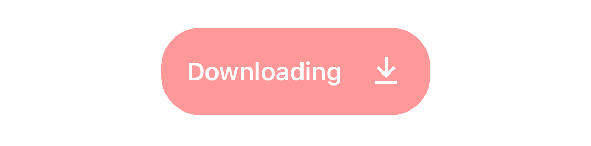
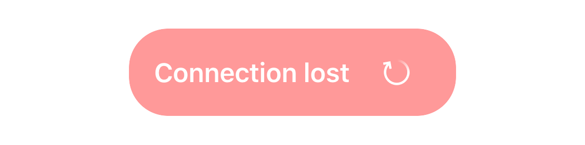
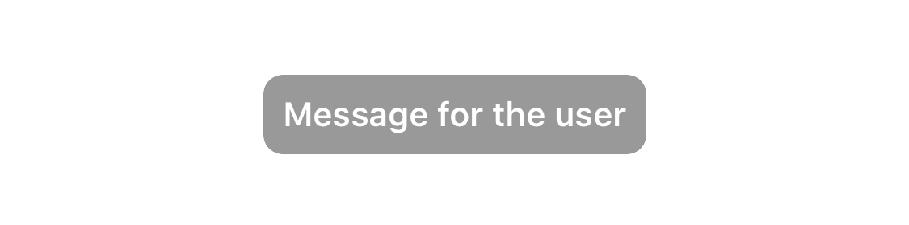

# 🍞 Rye


[](https://github.com/Carthage/Carthage)
[](https://cocoapods.org/pods/Rye)

[](https://github.com/nodes-ios/Rye/blob/master/LICENSE)


## Intro

Rye allows you to present non intrusive alerts to your users.

You can choose to display the default Rye alert type or go fully custom and display your own `UIView`.

### Examples


|  |   |   |
|----------------|---|---|
|      <center>Custom Rye alert with Image</center>      |  <center>Custom Rye alert with Button</center>  |  <center>Default Rye alert</center> |

## 📝 Requirements

iOS 11.4  
Swift 5

## 📦 Installation

### Swift Package Manager
Copy this repository URL, and add the repo into your Package Dependencies:
```
https://github.com/nodes-ios/Rye.git
```

### Carthage
```bash
github "nodes-ios/Rye"
```

### Cocoapods
```bash
pod 'Rye'
```

## 💻 Usage

### Principles

To display a Rye alert you declare a new `RyeViewController` and then call:

- `show()`: to show the alert
- `dismiss()`: to dismiss the alert

**Note:** Depending on which `dismissMode` you have selected, you may not need to dismiss the alert yourself, see the section about [`displayModes`](#display-modes) below for more information.

At the very minimum you need to consider:

- which text to show
- whether to show a standard alert or bring your own custom view to the party
- where to show the alert (`top` or `bottom`)

#### Show Text

To show a text using a Rye alert you need to create a `RyeConfiguration`. This is a dictionary allowing you to configure various UI related aspects of your Rye alert. For more information on available keys, please refer to the [Possible Rye Configuration Values](#possible-rye-configuration-values) section.

One of the values you can add to a `RyeConfiguration` is a text to show in your alert.

```swift
let ryeConfiguration: RyeConfiguration = [ Rye.Configuration.Key.text: "Message for the user" ]
```

#### Alert Type

You can use the default Rye alert or you can create your own UIView and use that instead. To determine which to use, you use the `Rye.ViewType` enum defined like so:

```swift
public enum ViewType {
    case standard(configuration: RyeConfiguration?)
    case custom(UIView, configuration: RyeConfiguration?)
}
```

As you can see, both the `standard` and the `custom` ViewType takes an optional `RyeConfiguration` as a parameter. This means that you don't _have_ to provide a `RyeConfiguration` in which case default values will be used for all parameters including the text (but you probably don't want an alert showing the text "Add a message", do you?).

 Additionally, the `custom` ViewType takes your custom UIView that you would like to use. 
 
 Note that some of the `RyeConfiguration` keys are not relevant when using a custom view. More specificaly, these are the keys not used when you decide to use a `custom` view for your message:

 - backgroundColor
 - textColor
 - textFont
 - text
 - cornerRadius

 
 For more on the `AnimationType` please refer to the section [Animation Type](#animation-type) below.

#### Where To Show the Alert?

Where to show a Rye alert is determined by the `Rye.Position` and `Rye.Alignment` enums which are defined like so:

```swift
public enum Position {
    case top(inset: CGFloat)
    case bottom(inset: CGFloat)
}
```

```swift
public enum Alignment {
    case leading(inset: CGFloat)
    case center
    case trailing(inset: CGFloat)
}
```

If the alignment is not specified at init time, it will default to `.center` alignment.

For more on `Rye.Position` and `Rye.Alignment`, please refer to the section [Position & Alignment](#position-and-alignment) below.

### Display a Default Rye

Following these principles, we are now ready to show our first Rye alert.

```swift
import Rye
...
let ryeConfiguration: RyeConfiguration = [Rye.Configuration.Key.text: "Message for the user"]
let rye = RyeViewController(
   viewType: .standard(configuration: ryeConfiguration),
   at: .bottom(inset: 16)
)
rye.show()
```

This will result in a Rye alert with the text "Message for the user" appearing at the bottom of the screen, and then disappearing automatically after 2.5 seconds.

### Control the Dismiss Type

If you would like the Rye alert to disappear in a different way, you can pass a `dismissMode` parameter when creating the `RyeViewController`

```swift
import Rye
...
let ryeConfiguration: RyeConfiguration = [Rye.Configuration.Key.text: "Message for the user"]
let rye = RyeViewController(
   dismissMode: .gesture,
   viewType: .standard(configuration: ryeConfiguration),
   at: .bottom(inset: 16)
)
rye.show()
```

The alert will now stay on the screen until the user taps or swipes at it.

### Display Default Rye with Custom Configuration

If you want to have more control over the alert view, you can add keys and values to the `RyeConfiguration` dictionary as shown below:

```swift
import Rye
...
let ryeConfiguration: RyeConfiguration = [
    Rye.Configuration.Key.text: "Error message for the user",
    Rye.Configuration.Key.backgroundColor: UIColor.red.withAlphaComponent(0.4),
    Rye.Configuration.Key.animationType: Rye.AnimationType.fadeInOut
]

let rye = RyeViewController(
   viewType: .standard(configuration: ryeConfiguration),
   at: .bottom(inset: 16)
)
rye.show()
```

### Display Rye with a Custom `UIView`

For even more control you can create your own subclass of `UIView` and use `.custom` for the `viewType` parameter

```swift
import Rye
...

let customView = YourCustomView()
let rye = RyeViewController(viewType: .custom(customView))

rye.show()
```

### Dismiss Completion
If you would like to execute some code when the Rye alert is dismissed you can pass a `dismissCompletion` code block when calling `show` like so:

```swift
import Rye
...
let ryeConfiguration: RyeConfiguration = [Rye.Configuration.Key.text: "Message for the user"]
let rye = RyeViewController(
   viewType: .standard(configuration: ryeConfiguration),
   at: .bottom(inset: 16)
)

rye.show(withDismissCompletion: {
    print("Goodbye from Rye, time to dy..die")  
})
```

### Dismiss Rye Alerts Manually

If you have selected to show a Rye alert as `.nonDismissable` you have to dismiss it yourself. Keep a reference to the `RyeViewController` and call `dismiss` when you are ready to let go.

```swift
import Rye
...
var rye: RyeViewController?

let ryeConfiguration: RyeConfiguration = [Rye.Configuration.Key.text: "Message for the user"]
rye = RyeViewController(
   dismissMode: .nonDismissable,
   viewType: .standard(configuration: ryeConfiguration),
   at: .bottom(inset: 16)
)

rye?.show()

...at a later point in time
rye?.dismiss()
```

### Descriptions of Parameters

Below you can find descriptions of the various parameters used to control a Rye alert.

#### Display Modes

Rye supports three different `displayMode` values which can be passed when creating a new `RyeViewController`:

- `automatic`: The alert appears and disappears automatically after a specified interval.
- `gesture`: To dismiss the alert you can tap or swipe it.
- `nonDismissable`: The alert will stay permanently on the screen until it is dismissed by calling `dismiss()` on your `RyeViewController` instance.

If you do not pass this value when creating a new `RyeViewController`, a default value of `automatic` with a default interval of 2.5 seconds is used (the default interval is defined in `Rye.defaultDismissInterval`)

#### Position and Alignment

You can specify if the Rye alert should be shown at the top or bottom of the screen. This is specified via the `position` parameter at init time. The `position` parameter takes an associated value, that allows you to define an inset.

By default Rye will calculate the safe area insets for you, so be sure to specify only the extra desired inset.

Similarly, you can set the alignment of the Rye via the `aligned` parameter. The `.leading` and `.trailing` alignments also take an associated value, that allows you to define an inset.
If the `aligned` parameter is not specified at init time, it will default to `.center`

#### Animation Type

Rye provides two animation types:

- `slideInOut`: slides the view in from either top or bottom (depending on which `Position` you have selected). When dismissed the view slides out in the same direction.
- `fadeInOut`: fades the view in and out again when dismissed.

To control how long the animation will take, please use the `animationDuration` key of the `RyeConfiguration` and provide a `TimeInterval` value.

If you _do not_ provide a value for `animationDuration`, a standard value of 0.3 seconds is used.

#### Ignore Safe Areas

When determining where to show the Rye message you can select whether to include `safeLayoutArea` insets in the calculation or not.

This is done by setting the `.ignoreSafeAreas` value in the `RyeConfiguration`.

The default value is `false`, meaning that safe area insets will be used in the calculation.

#### Possible Rye Configuration Values

The following keys can be used in the configuration dictionary:

    .backgroundColor (must be a UIColor)
    .textColor (must be a UIColor)
    .textFont (must be a UIFont)
    .text (must be a String)
    .cornerRadius (must be a CGFloat)
    .animationType (must be a Rye.AnimationType)
    .animationDuration (must be a TimeInterval)
    .ignoreSafeAreas (must be a bool)

If configuration is set to nil, a default configuration will be used. Any options set, will override the default state.

## ⚠️ Gotchas

In order to display a Rye message, a `parentView` is needed to determine _in relation to what_ the Rye message is positioned.

If you try to display a Rye message before a `parentView` can be obtained, you will see this warning in the console of your IDE.

> A parentView could not be found to display the Rye message on. Are you trying to show a Rye message before the view lifecycle is ready to display views?

This can be seen if you try to call `show()` on a `RyeViewController` in `viewDidLoad()` of a `UIViewController` for instance.


## Example Project
To learn more, please refer to the RyeExample project contained in this repository.

## ⬆️ Updating from v1.x.x to v2.0.0
In version 2.0.0 of Rye we changed the way you display messages.

Gone is the distinction between `.toast` and `.snackBar`. Instead, every message is now displayed in a separate `UIWindow` at the very top level of your view stack and you must decide how to dismiss the message with the previously described [`displayModes`](#display-modes).

This also means that the previous init method: `RyeViewController.init(alertType:viewType:at:timeAlive:)` has been deprecated. If you use this init method with version 2.0.0 you will receive a deprecation warning during compilation.

You can - if you stubbornly insist - still use the now old `init` method. Behind the scenes Rye will create a new `RyeViewController` for you and set the `displayMode` based on these rules:

_If_ you have added a `timeAlive` value, that `timeAlive` will be used to create a `displayMode` with a value of `.automatic(interval: timeAlive)`

_If_ you have _not_ added a `timeAlive` value, the `displayMode` will be `.nonDismissable`.

## 👥 Credits
Made with ❤️ at [Nodes](http://nodesagency.com).

## 📄 License
**Rye** is available under the MIT license. See the [LICENSE](https://github.com/nodes-ios/Rye/blob/master/LICENSE) file for more info.
